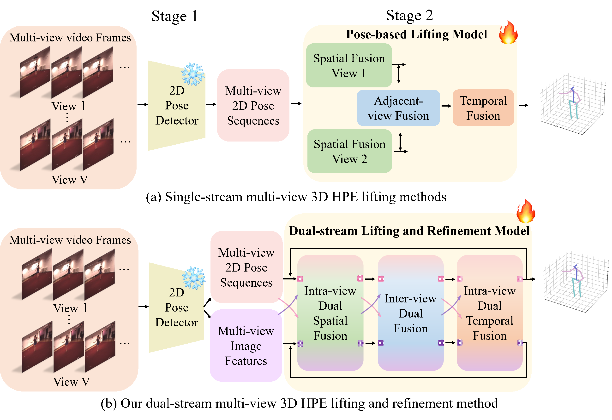
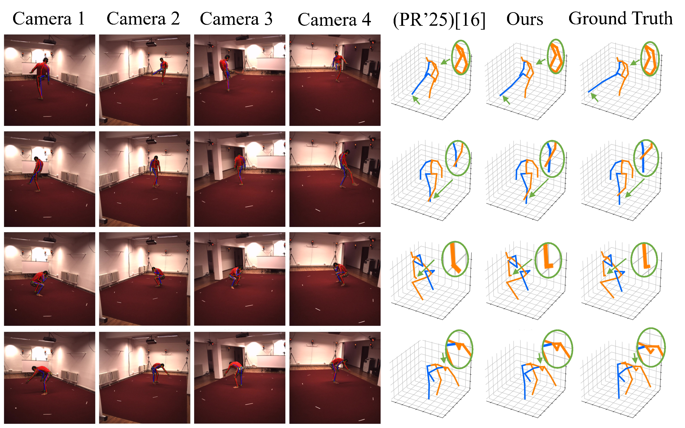
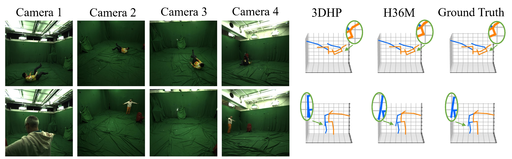
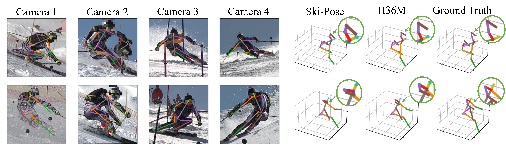

# DSVTformer: Dual-stream Spatial-View-Temporal Transformer for Multi-view 3D Human Pose Estimation

DSVTformer is a multi-view 3D human pose estimation framework that integrates **2D pose features** and **per-view image context features** using a **dual-stream transformer architecture**.
The model explicitly decomposes and models **Spatial-View-Temporal (SVT)** correlations via axis-aware attention blocks, enabling robust 3D pose estimation **without requiring camera parameters**.

*This repository provides an open-source implementation accompanying a manuscript currently under review. 
Detailed descriptions and experimental results may be updated as the review process progresses.*



## Highlights

- **Dual-stream formulation**: jointly leverages 2D keypoints and image context features, improving robustness to noisy or degraded 2D detections.
- **Axis-aware SVT decomposition**: sequential modeling of spatial, view, and temporal correlations through dedicated dual-stream fusion blocks.
- **Calibration-free**: no camera intrinsics or extrinsics are required during training or inference.
- **Stable performance** across different 2D pose detectors on Human3.6M.

## Method Overview

DSVTformer consists of two stages:

1. **Feature Extraction**
   For each frame and camera view, a pre-trained **YOLOv3** detector is used to localize the human bounding box, followed by cropping and resizing to a fixed resolution.
   A pre-trained **CPN** network is then used as a **frozen feature extractor** to obtain:
   - 2D joint coordinates
   - Per-view image context features

   The heatmap prediction head is removed, and only backbone features are retained.

2. **Dual-stream SVT Decoder**
   Multiple stacked decoder layers (default **L = 2**) are employed.
   Each layer performs:
   - Self-modal enhancement within pose and image streams
   - Bidirectional cross-modal interaction (Image-to-Pose and Pose-to-Image)
   - Axis-specific modeling across spatial, view, and temporal dimensions

## Requirements

- Python **3.8.19**
- PyTorch **1.8.0+cu111** 
- numpy
- tqdm
- fvcore
- pytz
- opencv-python

## Dataset: Human3.6M

This repository supports experiments on **Human3.6M** following the **standard evaluation protocol**.

### Splits and Metrics

- **Training subjects**: S1, S5, S6, S7, S8
- **Testing subjects**: S9, S11
- **Evaluation metrics**:
  - MPJPE (Protocol P1)
  - PA-MPJPE (Protocol P2)

## Qualitative Results

We visualize our reconstruction quality across three benchmarks. The following figures show representative results from our method on each dataset.

### Human3.6M



### 3DHP



### SkiPose



## Training / Evaluation

### Default Training Command (Human3.6M)

```bash
python main_img.py \
  --frames 27 \
  --batch_size 64 \
  --nepoch 50 \
  --lr 0.0002 \
  --model dsvtformer \
  --depth 2 \
  --gpu 0 \
  --embed_dim_ratio 32 \
  --img_embed_dim_ratio 16
```

### Evaluation Only

To run evaluation without training, add the `--test` flag:

```bash
python main_img.py --test
```


## 2-View (Uncalibrated) Workflow

This fork adds support for the 2-camera uncalibrated setup described in
the project plan. Camera pair `0,1` (H36M ids `54138969` + `55011271`)
is used by default — its optical-axis angle (~129°) is the closest
cross-baseline pair to the spec's 90° depth-reconstruction goal.

### Local sanity (Mac / cheap GPU) — no Docker needed

```bash
# 1. Forward-pass shape check (takes seconds)
python sanity_check.py --num_view 2 --frames 27 --depth 2 --model dsvtformer

# 2. Mini-train on real H36M data (H3WB release, ~1k samples, 10 epochs)
#    Drops loss_curve.png + mini_best.pth + pose_animation.gif into outputs_h3wb/
python scripts/mini_train_h3wb.py \
  --model dsvtformer --num_view 2 --view_indices 0,1 \
  --frames 27 --depth 2 --embed_dim_ratio 32 --img_embed_dim_ratio 16 \
  --batch_size 8 --nepoch 10 --lr 0.0005

# 3. Inference + 3D skeleton animation
python inference.py \
  --model dsvtformer --num_view 2 --view_indices 0,1 \
  --frames 27 --depth 2 --embed_dim_ratio 32 --img_embed_dim_ratio 16 \
  --previous_dir outputs_h3wb/mini_best.pth \
  --kpts_2d outputs_h3wb/kpts_2d.npy \
  --img_feat outputs_h3wb/img_feat.npy \
  --out_dir outputs_h3wb
```

### Production training on RTX 6000 (96 GB) — via Docker

Prerequisite on the GPU host: **Docker + NVIDIA Container Toolkit**
(`nvidia-smi` works inside `docker run --gpus all nvidia/cuda:11.1.1-base nvidia-smi`).

```bash
# 1. Build the image (one-time, ~10 min)
docker build -t dsvtformer:latest .

# 2. Smoke-test that CUDA is visible inside the container
docker run --rm --gpus all dsvtformer:latest \
    python -c "import torch; print('CUDA OK:', torch.cuda.is_available(), torch.cuda.get_device_name(0))"

# 3. Full training run
#    Mount your dataset + a host dir for checkpoints. Adjust paths as needed.
docker run --rm --gpus all \
    -v /path/on/host/dataset:/data/dataset \
    -v /path/on/host/Human3.6M/images:/data/Human3.6M/images \
    -v $(pwd)/checkpoint:/workspace/DSVTformer/checkpoint \
    dsvtformer:latest bash scripts/train_rtx6000.sh

# 4. Inference + animation (writes to ./outputs on host)
docker run --rm --gpus all \
    -v $(pwd)/checkpoint:/workspace/DSVTformer/checkpoint \
    -v $(pwd)/outputs:/workspace/DSVTformer/outputs \
    dsvtformer:latest \
    python inference.py \
      --model dsvtformer --num_view 2 --view_indices 0,1 \
      --frames 27 --depth 2 --embed_dim_ratio 32 --img_embed_dim_ratio 16 \
      --previous_dir checkpoint/best.pth \
      --kpts_2d outputs/kpts_2d.npy --img_feat outputs/img_feat.npy \
      --out_dir outputs
```

Tips:
- Tăng `batch_size` trong `scripts/train_rtx6000.sh` (đang đặt 384) lên ~512 nếu `nvidia-smi` còn dư VRAM nhiều.
- Dùng `-d --name dsvtformer-train` thay `--rm` để chạy nền + theo dõi bằng `docker logs -f dsvtformer-train`.
- `HEALTHCHECK` trong Dockerfile sẽ tự fail container nếu GPU bị thu hồi giữa chừng — kiểm tra bằng `docker ps` (cột STATUS).

### Datasets

| File | Source | Required for |
|------|--------|--------------|
| `dataset/train_data.npy` + `dataset/metadata.npy` | [H3WB Drive](https://drive.google.com/file/d/1LZh4Jsg3_ZKBF0iEPiexzoGHE4srLgfC) | `mini_train_h3wb.py` (already downloaded) |
| `dataset/data_2d_h36m_cpn_ft_h36m_dbb.npz` | [VideoPose3D DATASETS.md](https://github.com/facebookresearch/VideoPose3D/blob/main/DATASETS.md) | full training via `mini_train.sh` / `train_rtx6000.sh` |
| `dataset/data_3d_h36m.npz` | Built from H36M CDF (EULA at vision.imar.ro) via VideoPose3D `prepare_data_h36m.py` | full training |
| `images/` (raw frames) | Human3.6M EULA download → run `image_features/gen_features_cpn.py` | dual-stream image features |

Use `bash scripts/download_h36m.sh` for guided download instructions.

## Notes on Reproducibility

- Optimizer: Adam
- Initial learning rate: 0.0002
- Learning rate decay: 0.98 per epoch
- Training epochs: 50
- Default configuration: 2 decoder layers, 4 camera views, 27-frame temporal window
- Loss function: L2 loss
- Camera parameters: not used

## License

Please refer to the `LICENSE` file in the repository root.
